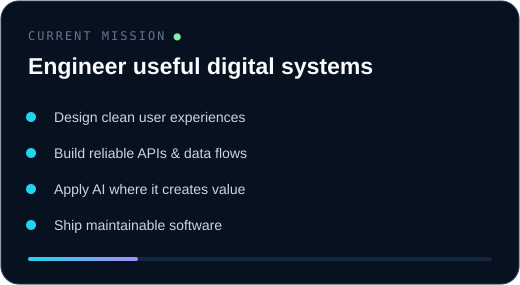
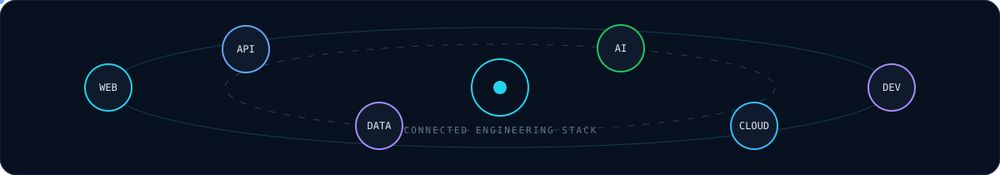
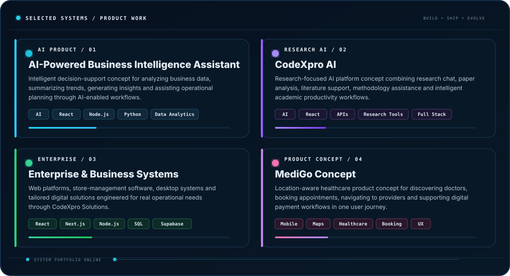
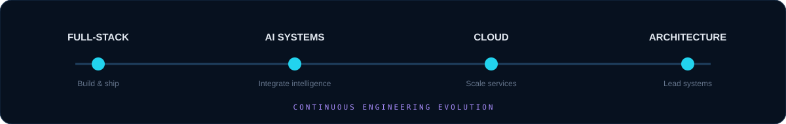

 

 

## ◈ Developer Overview

<table>
<tr>
<td width="54%" valign="top">

</td>
<td width="46%" valign="top">

</td>
</tr>
</table>

 

## ◈ Technology Constellation

  

 

 

## ◈ Selected Systems & Product Work

 

## ◈ GitHub Intelligence

 

## ◈ Engineering Direction

 

I’m continuing to deepen my work across **software engineering, AI-enabled applications, cloud-backed systems, scalable full-stack architecture and applied computing research**. I enjoy turning real requirements into clean, maintainable products with measurable value.

### Connect

 

